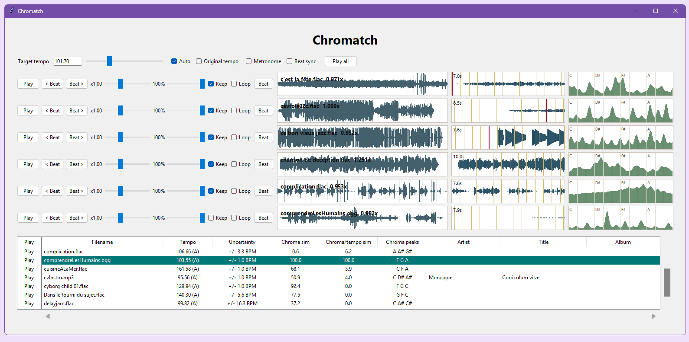
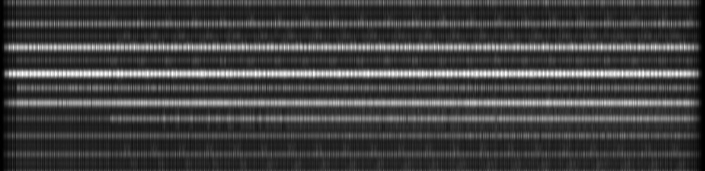
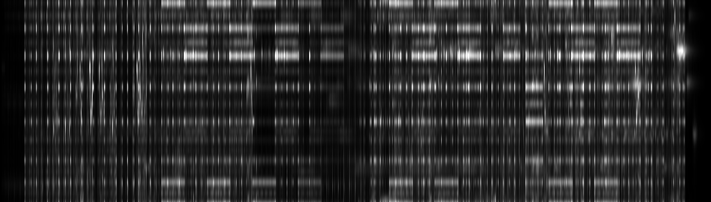
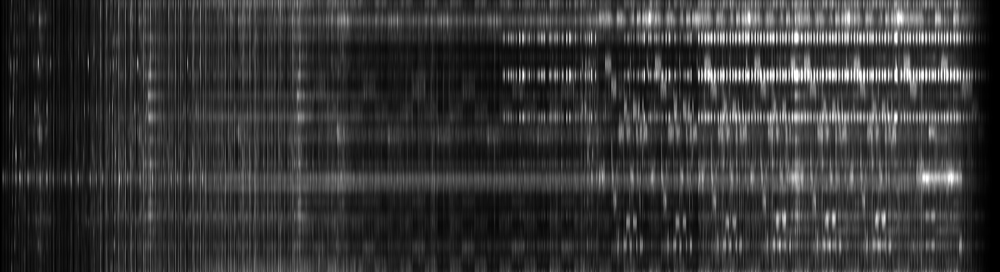
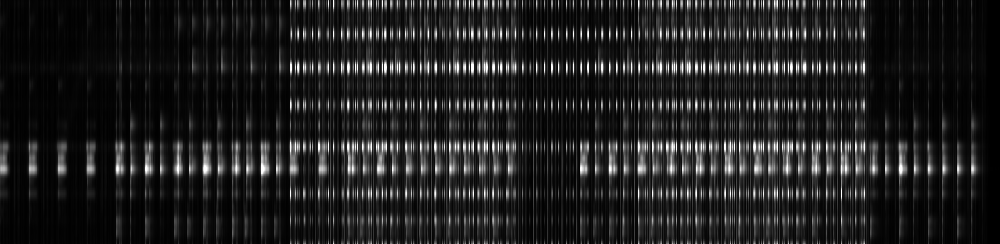
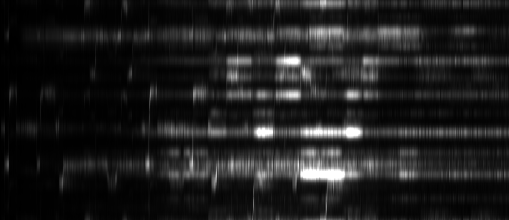
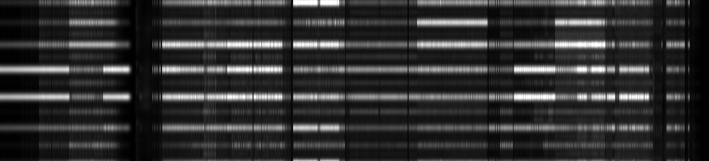
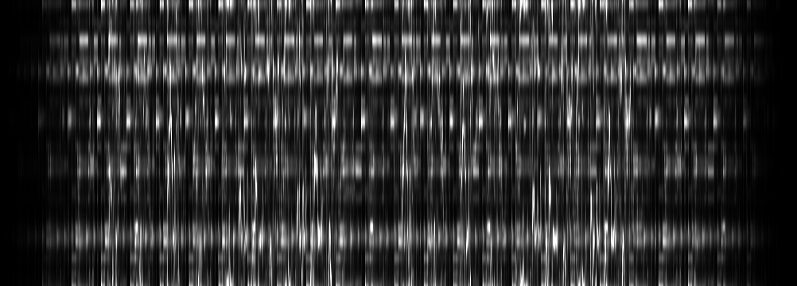
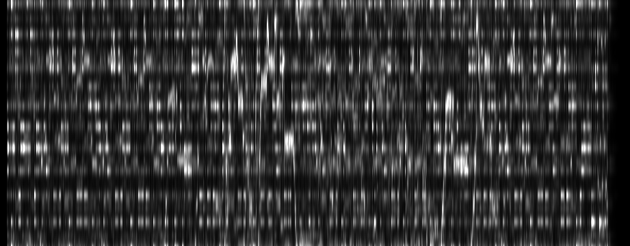

# Chromatch

Chromatch is a tool for exploring audio tempo and chroma compatibility between tracks.

It analyzes audio files, estimates tempo, builds chroma profiles, compares tracks, and provides playback tools for checking beat alignment and harmonic relationships.

## Features

- Analyze audio files or folders.
- Load and update CSV analysis files.
- Estimate tempo and chroma profile.
- Apply tapped or confirmed tempo corrections.
- Allow user-defined beat sync points, and harmony base notes marking.
- Compare tracks by chroma similarity and chroma/tempo similarity.
- Display waveform, zoomed waveform, beat markers, chroma histogram, and timed chromagram exports.
- Play multiple displayed tracks with tempo matching, per-track speed/volume, looping, metronome, and beat sync.

## Interface



## Generated Evolving Chromagrams

Chromatch can export evolving chromagrams as image files. These examples show the pitch/chroma content changing over time.

















## Files

Project files:

- `chromatch.py`: main application.
- `test_chromatch_regression.py`: regression test suite.
- `todo.txt`: current task list and review queue.
- `chromatch-analysis.csv`: local analysis data, when present.

## Run

```bash
python chromatch.py
```

## Verify

```bash
python -m unittest test_chromatch_regression.py
python -m py_compile chromatch.py
```
